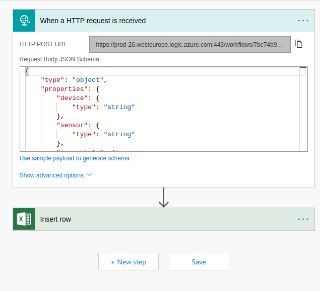

# Excel Online integration

This article describe how to store data from BigClown do [Microsoft Excel Online](https://products.office.com/excel).

## Prerequsities

* MQTT broker listening to BigClown dongle.
* Microsoft Id
* Python 3

## Setup online environment

### Excel table

* Login to [Onedrive](https://onedrive.live.com) using your Microsoft Id.

* Open folder or create new one where you want to place new Excel file to store data from BigClown.


* Click new on left up corner and choose _New_ - _Excel Workbook_


* It opens new Excel file in online editor.

* Click name of Excel workbook on top of screen and rename it.


* Create table header _device_, _sensor_, _sensorInfo_, _measurement_, _value_, _time_.


* Create Table from header. Click to eny cell with table header and click _Format as Table_.


* Check _My table has header_.


* Excel is ready.


* Close browser tab with Excel.

### Flow

* On top left corner click _List of Microsoft Services_ and open _Flow_.


* On top bar on left click _My Flows_ and click _Create from blank_. Click button _Create from blank_.


* Now you see empty Flow.


* Search for _Request_ action.


* Click _Request - When a HTTP request is received_.


* Now we need to describe JSON object we will send to Flow. Click _Use sample payload to generate schema_ bellow text box.

* Paste sample JSON to text box.

```
{"device": "temperature-button:0", "sensor": "thermometer", "sensorInfo": "0:0", "measurement": "temperature", "value": "27.44", "time": "2018-10-06 20:08:38"}
```


* Click _Done_.


* Click _+ New Step_ and _Add an Action_. Search _Excel_.


* Click _Excel - Insert row_.


* Choose Excel file you created.


* When you create table it gets name. Choose name of created table.


* Map columns to properties of JSON.


* Click _Save_ on top right.
* Click _My flows_.


## Local application

* Clone BC2JsonPostPy

```
git clone https://github.com/bechynsky/BC2JsonPostPy.git
```

* Go back to _Flow_ dashboard.
* Click _Edit flow_ symbol 
* Click _Request_ action and copy _HTTP POST URL_



* Edit _config.ini_. In _URL_ you must doubled _%_ symbol.

```
[DEFAULT]
URL = https://prod-26.westeurope.logic.azure.com:443/workflows/7bc74b9fce644126a478ae047d835a7e/triggers/manual/paths/invoke?api-version=2016-06-01&sp=%%2Ftriggers%%2Fmanual%%2Frun&sv=1.0&sig=ba_mcMZYbxxxxxxxxxD2TnfQie1KFM5o_7eQRKm0A
MQTT_SERVER = localhost
MQTT_PORT = 1883
```

* Run application. 

```
python3 main.py
```

* Sample output. Answer from server _202_ means everything is OK. If you get _404_ you have wrong _URL_.

```
user@user-pc:~/BC2JsonPostPy$ python3 main.py 
Connected with result code 0
{'device': 'temperature-button:0', 'sensor': 'thermometer', 'sensorInfo': '0:0', 'measurement': 'temperature', 'value': b'26.44', 'time': '2018-10-06 20:55:56'}
202
{'device': 'temperature-button:0', 'sensor': 'thermometer', 'sensorInfo': '0:0', 'measurement': 'temperature', 'value': b'26.44', 'time': '2018-10-06 20:55:59'}
202
{'device': 'temperature-button:0', 'sensor': 'thermometer', 'sensorInfo': '0:0', 'measurement': 'temperature', 'value': b'26.44', 'time': '2018-10-06 20:56:03'}
202
{'device': 'kit-lcd-thermostat:0', 'sensor': 'thermometer', 'sensorInfo': 'set-point', 'measurement': 'temperature', 'value': b'20.00', 'time': '2018-10-06 20:59:06'}
202

```

## Open Excel

* Open Excel to see data.


